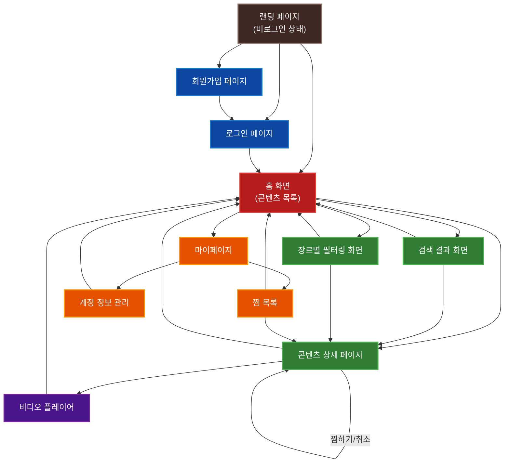

```mermaid
flowchart TB
    %% 노드 정의
    landing["랜딩 페이지<br>(비로그인 상태)"]:::landingPage
    login["로그인 페이지"]:::authPage
    signup["회원가입 페이지"]:::authPage
    home["홈 화면<br>(콘텐츠 목록)"]:::mainPage
    search["검색 결과 화면"]:::contentPage
    genre["장르별 필터링 화면"]:::contentPage
    details["콘텐츠 상세 페이지"]:::contentPage
    player["비디오 플레이어"]:::playerPage
    mypage["마이페이지"]:::userPage
    wishlist["찜 목록"]:::userPage
    account["계정 정보 관리"]:::userPage
    
    %% 연결선 정의
    landing --> login
    landing --> signup
    landing --> home
    
    login --> home
    signup --> login
    
    home --> search
    home --> genre
    home --> details
    home --> mypage
    
    search --> details
    genre --> details
    
    details --> player
    details -- "찜하기/취소" --> details
    
    mypage --> wishlist
    mypage --> account
    
    wishlist --> details
    
    %% 모든 페이지에서 홈으로 돌아갈 수 있음
    search --> home
    genre --> home
    details --> home
    player --> home
    wishlist --> home
    account --> home
    
    %% 스타일 정의
    classDef landingPage fill:#3E2723,color:#FFF,stroke:#8D6E63,stroke-width:2px
    classDef authPage fill:#0D47A1,color:#FFF,stroke:#1976D2,stroke-width:2px
    classDef mainPage fill:#B71C1C,color:#FFF,stroke:#E53935,stroke-width:2px
    classDef contentPage fill:#2E7D32,color:#FFF,stroke:#4CAF50,stroke-width:2px
    classDef playerPage fill:#4A148C,color:#FFF,stroke:#7B1FA2,stroke-width:2px
    classDef userPage fill:#E65100,color:#FFF,stroke:#FF9800,stroke-width:2px
```