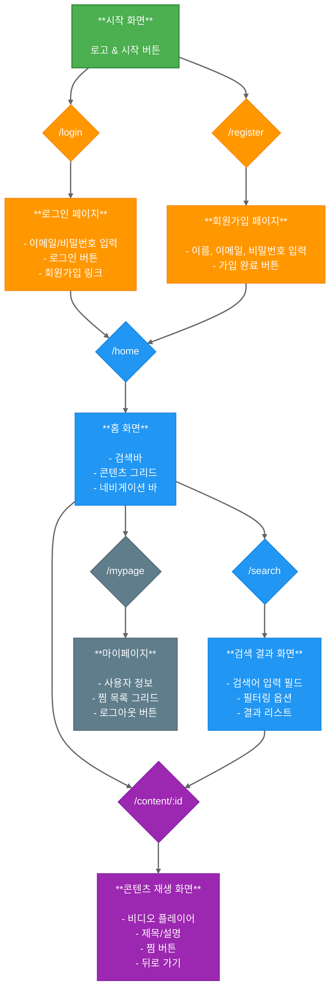

```mermaid
flowchart TD
    A["**시작 화면**<br><br>로고 & 시작 버튼"] --> B{"/login"}
    A --> C{"/register"}
    B --> D["**로그인 페이지**<br><br>- 이메일/비밀번호 입력<br>- 로그인 버튼<br>- 회원가입 링크"]
    C --> E["**회원가입 페이지**<br><br>- 이름, 이메일, 비밀번호 입력<br>- 가입 완료 버튼"]
    D --> F{"/home"}
    E --> F
    F --> G["**홈 화면**<br><br>- 검색바<br>- 콘텐츠 그리드<br>- 네비게이션 바"]
    G --> H{"/search"}
    G --> I{"/content/:id"}
    G --> J{"/mypage"}
    H --> K["**검색 결과 화면**<br><br>- 검색어 입력 필드<br>- 필터링 옵션<br>- 결과 리스트"]
    K --> I
    I --> L["**콘텐츠 재생 화면**<br><br>- 비디오 플레이어<br>- 제목/설명<br>- 찜 버튼<br>- 뒤로 가기"]
    J --> M["**마이페이지**<br><br>- 사용자 정보<br>- 찜 목록 그리드<br>- 로그아웃 버튼"]
    
    %% 스타일 정의
    classDef start fill:#4CAF50,stroke:#388E3C,color:white,stroke-width:2px;
    classDef auth fill:#FF9800,stroke:#F57C00,color:white;
    classDef main fill:#2196F3,stroke:#0B7DDA,color:white;
    classDef content fill:#9C27B0,stroke:#7B1FA2,color:white;
    classDef user fill:#607D8B,stroke:#455A64,color:white;
    
    %% 노드 스타일 적용
    class A start
    class B,C,D,E auth
    class F,G,H,K main
    class I,L content
    class J,M user
    
    %% 화살표 스타일
    linkStyle default stroke:#666,stroke-width:2px,fill:none;
```