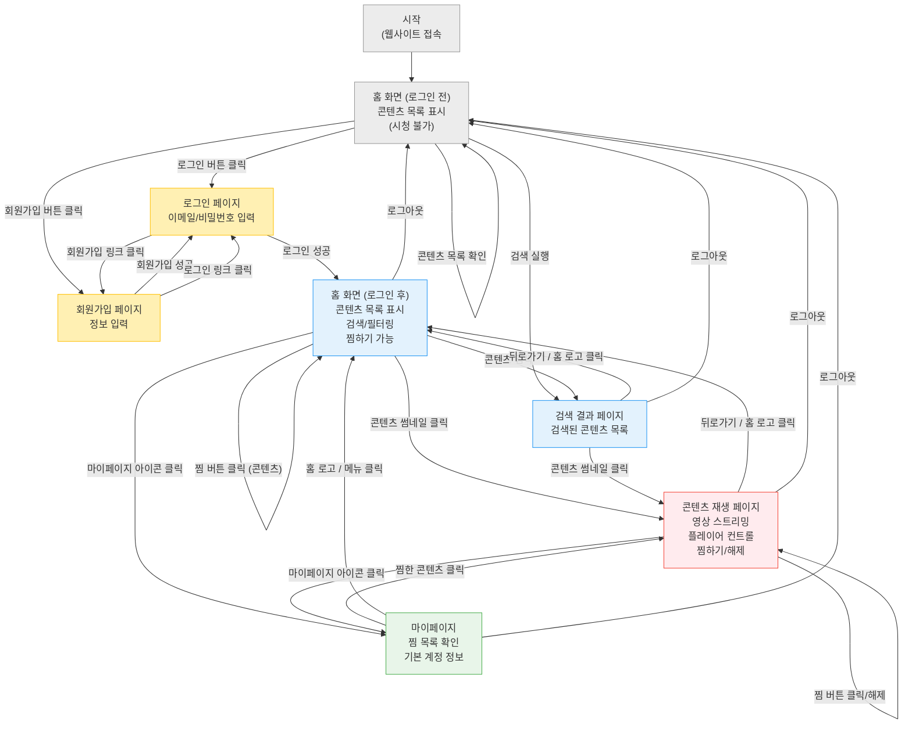

```mermaid
graph TD
    %% === 스타일 정의 ===
    classDef unauthStyle fill:#ececec,stroke:#999,stroke-width:1px,color:#333
    classDef authStyle fill:#fff0b3,stroke:#ffc107,stroke-width:1px,color:#333
    classDef coreStyle fill:#e3f2fd,stroke:#2196f3,stroke-width:1px,color:#333
    classDef playerStyle fill:#ffebee,stroke:#f44336,stroke-width:1px,color:#333
    classDef myPageStyle fill:#e8f5e9,stroke:#4caf50,stroke-width:1px,color:#333

    %% === 노드 정의 (화면) ===
    A["시작<br>(웹사이트 접속"]:::unauthStyle
    B["홈 화면 (로그인 전)<br>콘텐츠 목록 표시<br>(시청 불가)"]:::unauthStyle
    C["로그인 페이지<br>이메일/비밀번호 입력"]:::authStyle
    D["회원가입 페이지<br>정보 입력"]:::authStyle
    E["홈 화면 (로그인 후)<br>콘텐츠 목록 표시<br>검색/필터링<br>찜하기 가능"]:::coreStyle
    F["콘텐츠 재생 페이지<br>영상 스트리밍<br>플레이어 컨트롤<br>찜하기/해제"]:::playerStyle
    G["마이페이지<br>찜 목록 확인<br>기본 계정 정보"]:::myPageStyle
    H["검색 결과 페이지<br>검색된 콘텐츠 목록"]:::coreStyle

    %% === 화면 전환 흐름 ===
    A --> B

    %% 로그인 전 사용자 흐름
    B -- "콘텐츠 목록 확인" --> B
    B -- "로그인 버튼 클릭" --> C
    B -- "회원가입 버튼 클릭" --> D
    B -- "검색 실행" --> H

    %% 인증 흐름
    C -- "로그인 성공" --> E
    C -- "회원가입 링크 클릭" --> D
    D -- "회원가입 성공" --> C
    D -- "로그인 링크 클릭" --> C

    %% 로그인 후 사용자 흐름
    E -- "콘텐츠 썸네일 클릭" --> F
    E -- "콘텐츠 검색" --> H
    E -- "장르 필터링" --> E
    E -- "찜 버튼 클릭 (콘텐츠)" --> E
    E -- "마이페이지 아이콘 클릭" --> G
    E -- "로그아웃" --> B

    H -- "콘텐츠 썸네일 클릭" --> F
    H -- "뒤로가기 / 홈 로고 클릭" --> E
    H -- "로그아웃" --> B

    F -- "찜 버튼 클릭/해제" --> F
    F -- "뒤로가기 / 홈 로고 클릭" --> E
    F -- "마이페이지 아이콘 클릭" --> G
    F -- "로그아웃" --> B

    G -- "찜한 콘텐츠 클릭" --> F
    G -- "홈 로고 / 메뉴 클릭" --> E
    G -- "로그아웃" --> B
```