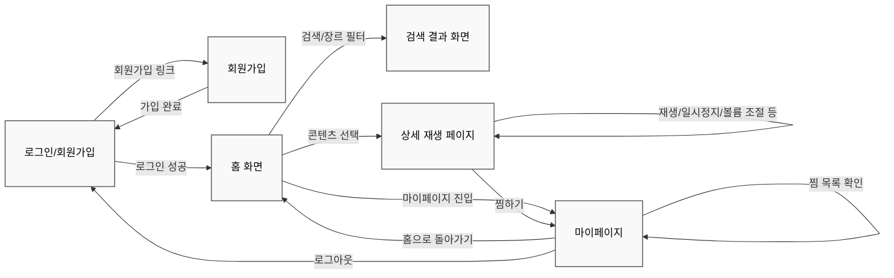

```mermaid
flowchart LR

    A["로그인/회원가입"]:::screen 
    B["회원가입"]:::screen 
    C["홈 화면"]:::screen 
    D["검색 결과 화면"]:::screen 
    E["상세 재생 페이지"]:::screen 
    F["마이페이지"]:::screen

    A -- "회원가입 링크" --> B
    B -- "가입 완료" --> A
    A -- "로그인 성공" --> C
    C -- "검색/장르 필터" --> D
    C -- "콘텐츠 선택" --> E
    C -- "마이페이지 진입" --> F
    E -- "재생/일시정지/볼륨 조절 등" --> E
    E -- "찜하기" --> F
    F -- "찜 목록 확인" --> F
    F -- "홈으로 돌아가기" --> C
    F -- "로그아웃" --> A

    classDef screen fill:#f9f9f9,stroke:#666,stroke-width:1.5px,color:#000,border-radius:6px,padding:10px
    class A,B,C,D,E,F screen

```