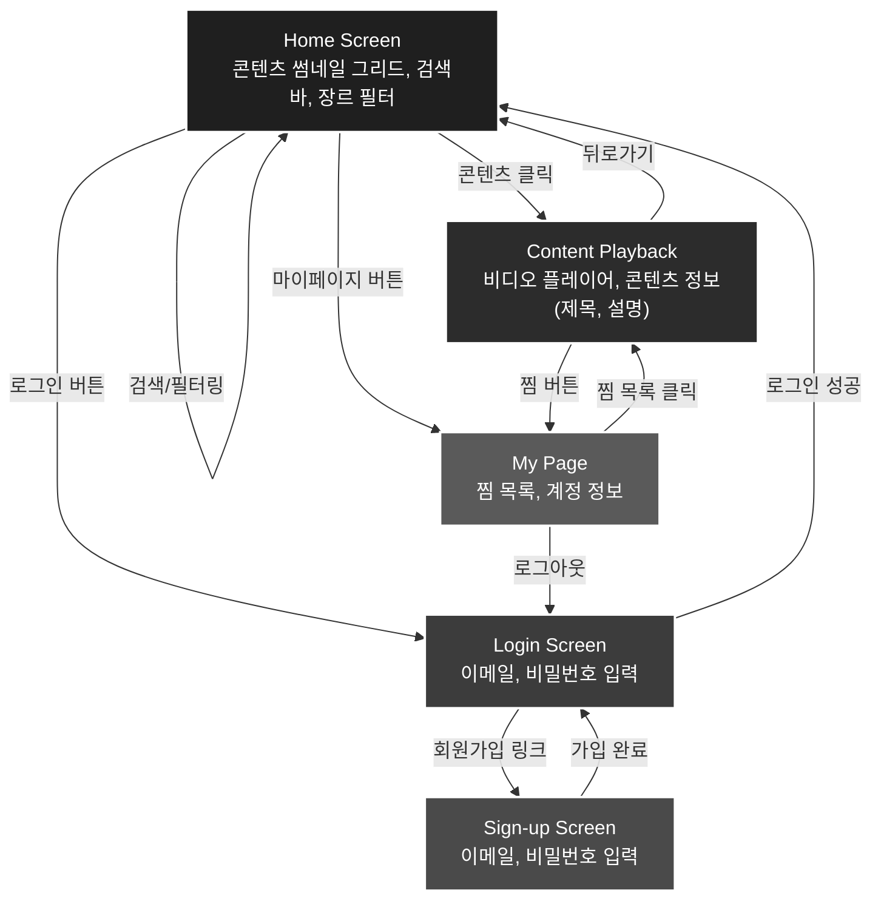

```mermaid
graph TD
    A["Home Screen<br>콘텐츠 썸네일 그리드, 검색바, 장르 필터"] -->|콘텐츠 클릭| B["Content Playback<br>비디오 플레이어, 콘텐츠 정보(제목, 설명)"]
    A -->|검색/필터링| A
    A -->|로그인 버튼| C["Login Screen<br>이메일, 비밀번호 입력"]
    C -->|회원가입 링크| D["Sign-up Screen<br>이메일, 비밀번호 입력"]
    D -->|가입 완료| C
    C -->|로그인 성공| A
    A -->|마이페이지 버튼| E["My Page<br>찜 목록, 계정 정보"]
    B -->|찜 버튼| E
    E -->|찜 목록 클릭| B
    B -->|뒤로가기| A
    E -->|로그아웃| C

    %% Styling for nodes
    classDef home fill:#1f1f1f,stroke:#ffffff,stroke-width:2px,color:#ffffff;
    classDef playback fill:#2c2c2c,stroke:#ffffff,stroke-width:2px,color:#ffffff;
    classDef login fill:#3c3c3c,stroke:#ffffff,stroke-width:2px,color:#ffffff;
    classDef signup fill:#4a4a4a,stroke:#ffffff,stroke-width:2px,color:#ffffff;
    classDef mypage fill:#5a5a5a,stroke:#ffffff,stroke-width:2px,color:#ffffff;

    %% Apply styles to nodes
    class A home;
    class B playback;
    class C login;
    class D signup;
    class E mypage;
```